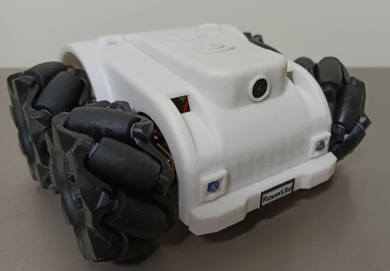
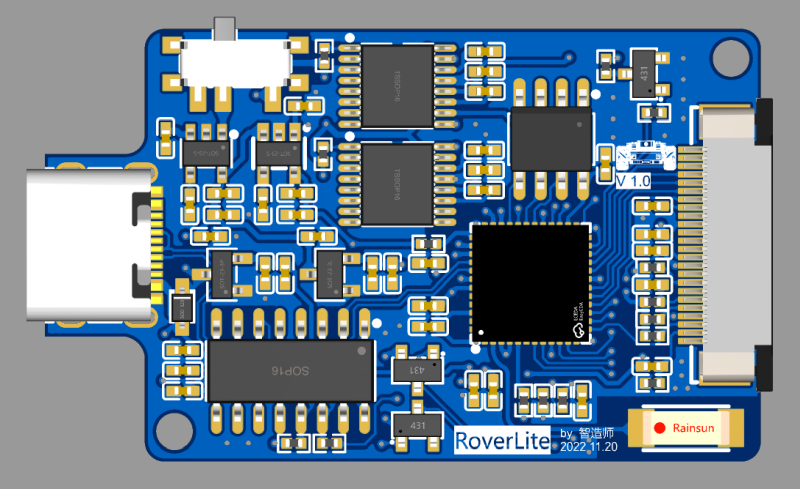

# RoverLite32

  

## How to Build
[Machanism](mechanism/)   
[Electronics](hardware/bom/electronics.md)   

## Demonstration (Video)
[Bilibili: 为对付家里的鹦鹉，我造出B站最难操控的 麦 轮 图 传 小 车](https://www.bilibili.com/video/BV1V14y1u79f)   
